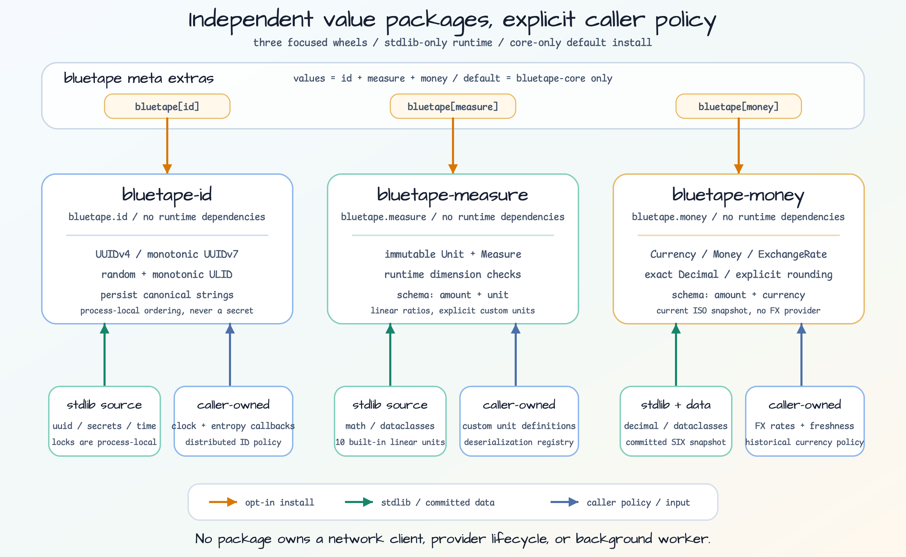
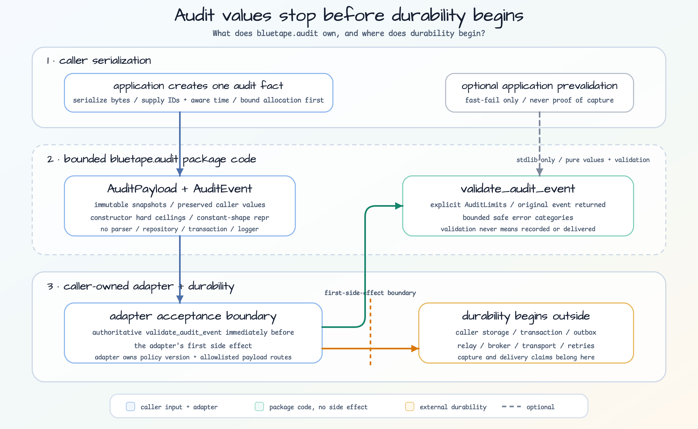

# bluetape-py

[English](README.md) | 한국어


백엔드 서비스, 테스트, 로깅, 운영 보조 기능을 위한 Python-native bluetape
라이브러리입니다.

`bluetape-py`는 `bluetape4k`, `bluetape-go`, `bluetape-rs`와 같은 생태계
운영 원칙을 따르지만, 다른 언어 구현을 기계적으로 옮기지 않습니다. Python
3.13+를 기준으로 시작하고, 기본 설치는 얇게 유지하며, 무거운 기능은 명시적인
PyPI 배포 패키지와 extras로 분리합니다.

## 현재 상태

`v0.1.0`은 첫 Python-native foundation 릴리스로 공개되었습니다:
[`v0.1.0`](https://github.com/bluetape4k/bluetape-py/releases/tag/v0.1.0).
PyPI 배포는 package ownership과 trusted publishing이 확인될 때까지 보류합니다.
collections, codec, compression, cache, Redis provider, serde, ID, measure,
money, testcontainers, audit 패키지는 source workspace에서 사용할 수 있으며,
registry 설치 명령은 PyPI 배포가 활성화된 뒤의 목표 형태를 설명합니다.

현재 계획 트랙은
[`0.2.0`](https://github.com/bluetape4k/bluetape-py/milestone/2) milestone입니다.
Ecosystem 이슈 #7-#34, serialization 후속 #45/#46, local cache #50, compressor
계약 #59, Redis provider #54, coordination #55를 추적합니다. 자세한 계획은
[`WIP.md`](WIP.md)에 두고, 완료된 사용자-facing 변경은
[`CHANGELOG.md`](CHANGELOG.md)에 기록합니다.

| 트랙 | 범위 |
|---|---|
| `v0.1.0` | 릴리스 완료: workspace, core, logging, testing, docs, release preflight. |
| `0.2.0` | Value package #13, Serde #45/#46, local cache #50, compressor 계약 #59, Redis provider #54, coordination #55를 포함한 생태계 작업. |
| PyPI publish | project ownership과 trusted publishing 확인 전까지 보류. |

## 워크스페이스 구조


저장소는 하나의 `uv` 워크스페이스이며, 여러 개의 목적별 배포 패키지를 가집니다.
메타 패키지는 의도적으로 작게 유지합니다. `pip install bluetape`는 기본적으로
`bluetape-core`만 설치하므로 core-only 기본 설치는 Redis-free입니다.

| 배포 패키지 | Import 경로 | 기본 설치 | 상태 | 목적 |
|---|---|---:|---|---|
| `bluetape` | 없음 | yes | active | `bluetape-core`에만 의존하는 얇은 메타 배포 패키지. |
| `bluetape-core` | `bluetape.core` | yes | active | 표준 라이브러리만 사용하는 검증 및 기반 헬퍼. |
| `bluetape-audit` | `bluetape.audit` | no | active, source workspace | 표준 라이브러리만 사용하는 불변 감사 값, 명시적 제한, 보존 헬퍼. |
| `bluetape-id` | `bluetape.id` | no | active, source workspace | 표준 라이브러리 기반 UUIDv4/v7과 random/monotonic ULID 값. |
| `bluetape-measure` | `bluetape.measure` | no | active, source workspace | Runtime dimension을 검사하는 불변 선형 측정값. |
| `bluetape-money` | `bluetape.money` | no | active, source workspace | Current ISO 4217 currency와 caller-owned FX rate를 사용하는 exact Decimal money. |
| `bluetape-async` | `bluetape.asyncio` | no | active, source workspace | 표준 라이브러리만 사용하는 bounded structured-concurrency 헬퍼. |
| `bluetape-codec` | `bluetape.codec` | no | active, source workspace | 엄격한 URL-safe Base64와 hexadecimal 헬퍼. |
| `bluetape-collections` | `bluetape.collections` | no | active, source workspace | 표준 라이브러리만 사용하는 eager iterable/list/dict 헬퍼. |
| `bluetape-compression` | `bluetape.compression` | no | active, source workspace | gzip, zlib, raw-DEFLATE, LZ4, Snappy, Zstandard를 제한된 크기로 처리하는 structural compressor 계약. |
| `bluetape-logging` | `bluetape.logging` | no | active | 표준 `logging`, `contextvars`, redaction 헬퍼. |
| `bluetape-observability` | `bluetape.observability` | no | active, source workspace | Resilience와 Redis observer event를 위한 API-only OpenTelemetry adapter. |
| `bluetape-resilience` | `bluetape.resilience` | no | active, source workspace | 표준 라이브러리 기반 sync/async retry, circuit breaker, bulkhead, cooperative async timeout policy. |
| `bluetape-testing` | `bluetape.testing` | no | active, internal-first | 이 워크스페이스 내부 테스트를 우선 지원하는 pytest 헬퍼와 작은 공개 안정 API. |
| `bluetape-serde` | `bluetape.serde` | no | active, source workspace | Strict JSON v1과 명시적인 CPython 3.13 Apache Fory extra. |
| `bluetape-cache` | `bluetape.cache` | no | active, source workspace | 표준 라이브러리만 사용하는 bounded sync/async local TTL loading cache. |
| `bluetape-cache-redis` | `bluetape.cache.redis` | no | active, source workspace | Byte-only Redis provider, 크기 제한 result envelope, sync/async load coordinator. |
| `bluetape-leader` | `bluetape.leader` | no | active, source workspace | 표준 라이브러리만 사용하는 backend-neutral leader와 distributed-lock 계약. |
| `bluetape-leader-redis` | `bluetape.leader.redis` | no | active, source workspace | Fencing을 갖춘 bounded single-primary Redis lock과 leader elector. |
| `bluetape-testcontainers` | `bluetape.testcontainers` | no | active, source workspace | 생태계가 관리하는 Redis 8, PostgreSQL 18, 선택 서비스 LocalStack 테스트 서버 수명주기와 연결 정보. |
| `bluetape-benchmark` | `bluetape.benchmark` | no | private, source-only | Build/test 대상 benchmark report와 comparison contract이며 publish하지 않음. |
| `bluetape-fastapi` | `bluetape.fastapi` | no | planned | core/logging/testing 계층이 안정화된 뒤 추가할 FastAPI 연동 헬퍼. |

## 설계 방향

- Python-native API를 먼저 설계합니다. Kotlin, Go, Rust 구현은 참고 대상이지
  복사 원본이 아닙니다.
- `bluetape-core`는 표준 라이브러리만 사용합니다.
- `bluetape-logging`은 `logging`과 `contextvars` 기반의 stdlib-first 모듈로
  유지합니다.
- `bluetape-id`, `bluetape-measure`, `bluetape-money`는 독립된 stdlib-only value
  배포 패키지입니다. 더 강한 ID coordination, custom unit registry, historical
  currency policy, FX provider는 caller가 소유합니다.
- `bluetape-resilience`는 stdlib-only로 유지하고 sync/async policy family를
  분리하며 sync timeout이나 hidden worker를 제공하지 않습니다.
- `bluetape-observability`는 직접 설치하며 runtime에는 OpenTelemetry API만
  사용합니다. SDK/exporter lifecycle은 application이 소유합니다.
- `bluetape-testing`은 `pytest`에 의존할 수 있지만, 넓은 공개 API를 약속하기
  전에 내부 지원 모듈로 먼저 성장시킵니다.
- 루트 `bluetape` 배포 패키지는 extras를 제공하지만, 루트
  `bluetape/__init__.py` import surface는 만들지 않습니다.
- 기본 meta 설치는 계속 core-only입니다. Cache, Redis, leader coordination,
  compression provider, resilience, observability, serde, Testcontainers는 opt-in이며
  Apache Fory는 trusted-internal 전용 `fory` extra로만 제공합니다.

## 설치

PyPI 배포는 아직 보류 중입니다. 배포가 활성화되기 전에는 registry 설치 명령 대신
아래의 로컬 workspace 명령을 사용합니다.

첫 PyPI 릴리스 이후의 공개 설치 형태는 다음과 같습니다.

```bash
pip install bluetape
pip install "bluetape[audit]"
pip install "bluetape[asyncio]"
pip install "bluetape[cache]"
pip install "bluetape[cache-redis]"
pip install "bluetape[leader]"
pip install "bluetape[leader-redis]"
pip install "bluetape[codec]"
pip install "bluetape[collections]"
pip install "bluetape[compression]"
pip install "bluetape[compression-lz4]"
pip install "bluetape[compression-snappy]"
pip install "bluetape[compression-zstd]"
pip install "bluetape[compression-native]"
pip install "bluetape[id]"
pip install "bluetape[logging]"
pip install "bluetape[measure]"
pip install "bluetape[money]"
pip install "bluetape[values]"
pip install "bluetape[resilience]"
pip install "bluetape[serde]"
pip install "bluetape[fory]"  # CPython 3.13 전용
pip install "bluetape[testing]"
pip install "bluetape[testcontainers]"
pip install "bluetape[dev]"
pip install "bluetape[all]"
```

목적별 배포 패키지를 직접 설치할 수도 있습니다.

```bash
pip install bluetape-core
pip install bluetape-audit
pip install bluetape-id
pip install bluetape-measure
pip install bluetape-money
pip install bluetape-async
pip install bluetape-cache
pip install bluetape-cache-redis
pip install bluetape-leader
pip install bluetape-leader-redis
pip install bluetape-codec
pip install bluetape-collections
pip install bluetape-compression
pip install "bluetape-compression[lz4]"
pip install "bluetape-compression[snappy]"
pip install "bluetape-compression[zstd]"
pip install "bluetape-compression[native]"
pip install bluetape-logging
pip install bluetape-observability
pip install bluetape-resilience
pip install bluetape-serde
pip install "bluetape-serde[fory]"  # CPython 3.13 전용
pip install bluetape-testing
pip install bluetape-testcontainers
pip install "bluetape-testcontainers[postgres]"
pip install "bluetape-testcontainers[aws]"
pip install "bluetape-testcontainers[all]"
```

저장소에서 로컬 개발 환경을 만들 때는 다음 명령을 사용합니다.

```bash
uv sync --all-packages --locked
uv sync --package bluetape-compression --extra native --locked
uv run --package bluetape-cache python -c "from bluetape.cache import AsyncTTLCache, TTLCache; assert TTLCache and AsyncTTLCache"
uv run --package bluetape-cache-redis python -c "from bluetape.cache.redis import BinaryEnvelopeFormat, SyncRedisProvider; assert BinaryEnvelopeFormat().format_id == 'binary-v1' and SyncRedisProvider"
uv run --package bluetape-observability python -c "from bluetape.observability.redis import OpenTelemetryRedisObserver; from bluetape.observability.resilience import OpenTelemetryPolicyObserver; assert OpenTelemetryPolicyObserver and OpenTelemetryRedisObserver"
uv run --package bluetape-resilience python -c "from bluetape.resilience import AsyncResiliencePipeline, ResiliencePipeline; assert ResiliencePipeline and AsyncResiliencePipeline"
uv run --package bluetape-serde python -c "import bluetape.serde"
uv sync --all-packages --extra fory --python 3.13.14 --locked
uv run --package bluetape-serde --extra fory --python 3.13.14 python -c "import bluetape.serde.fory"
uv run --package bluetape-testcontainers --extra all --group test --python 3.13.14 pytest \
  -m testcontainers packages/bluetape-testcontainers -q
```

#54 Redis provider 테스트는 생태계 래퍼의 `RedisServer`를 사용해 Redis 8 command,
TTL, NX, Lua compare-and-delete, lifecycle, ACL, redaction 동작을 검증합니다. Value는
명시적인 `serialize -> compress -> store` 조합을 사용합니다. Issue #55는 opt-in
패키지 경계를 유지하면서 bounded sync/async Redis lease coordination을 제공합니다.

Issue #15는 `postgres:18-alpine`과 `localstack/localstack:4.14.0`을 사용하는
caller-owned `PostgresServer`, `LocalStackServer` adapter를 추가합니다. Provider
extra는 focused package에서만 선택하며 루트 `bluetape[testcontainers]` extra는
계속 base-only입니다.

현재 focused wheel을 빌드하고 격리 환경에 설치한 뒤 strict JSON roundtrip을
실행할 수 있습니다.

```bash
tmp_dir="$(mktemp -d)"
trap 'rm -rf "$tmp_dir"' EXIT
uv build --package bluetape-serde --out-dir "$tmp_dir/dist"
uv venv "$tmp_dir/venv"
uv pip install --python "$tmp_dir/venv/bin/python" "$tmp_dir"/dist/bluetape_serde-*.whl
"$tmp_dir/venv/bin/python" -c 'from bluetape.serde import PayloadMetadata, TrustProfile, json_deserialize, json_serialize; m = PayloadMetadata(format="json", version=1, content_type="application/json", trust_profile=TrustProfile.UNTRUSTED); p = json_serialize({"order_id": 42}, metadata=m); assert json_deserialize(p, expected_metadata=m) == {"order_id": 42}'
```

현재 실행 가능한 경로는 로컬 workspace와 로컬 wheel뿐입니다. 위 `pip` 명령은
PyPI 배포가 활성화되기 전에는 registry에서 사용할 수 없습니다. Fory는 base,
`serde`, `dev`, `all` extra에 포함되지 않습니다.

## 사용 예

### Core validation

```python
from bluetape.core import require_not_blank

service_name = require_not_blank("orders", "service_name")
```

### Logging context

```python
import logging

from bluetape.logging import ContextLogFilter, log_context

logger = logging.getLogger("orders")
logger.addFilter(ContextLogFilter())

with log_context(trace_id="trace-123", tenant="blue"):
    logger.info("order accepted")
```

### Testing waits

```python
from bluetape.testing import eventually

eventually(lambda: cache.get("ready"), timeout=2.0)
```

### Collections

```python
from bluetape.collections import chunked, group_by

chunks = chunked(range(5), 2)
by_initial = group_by(["ant", "ape", "bee"], lambda value: value[0])
```

### Codec과 compression

```python
from bluetape.codec import base64url_encode
from bluetape.compression import Compressor, GzipCompressor
from bluetape.compression.native import ZstdCompressor

token = base64url_encode(b"order:42")
compressor: Compressor = GzipCompressor()
assert compressor.decompress(compressor.compress(token.encode("ascii"))) == token.encode("ascii")
assert ZstdCompressor().algorithm == "zstd-frame"
```

`bluetape.codec`는 canonical URL-safe Base64와 strict hex text만 decode합니다.
`bluetape.compression`은 structural `Compressor` Protocol과 gzip, zlib, raw
DEFLATE, LZ4 frame, raw Snappy, Zstandard frame용 frozen 구현을 제공합니다. 압축
해제 결과는 기본 64 MiB로 제한하며, 잘못되거나 잘렸거나 trailing data가 붙은
입력을 거부합니다. Native provider는 명시적인 extra로만 설치합니다. 다른
bluetape 언어 구현과 기능 및 실패 규칙의 의미는 맞추지만 언어 간 wire 호환은
약속하지 않습니다. Codec과 compression은 기본 설치에 포함되지 않습니다.

### Bounded asyncio 작업

```python
import asyncio

from bluetape.asyncio import map_bounded


async def fetch_order(order_id: int) -> str:
    await asyncio.sleep(0.01)
    return f"order-{order_id}"


async def main() -> None:
    print(await map_bounded([1, 2, 3], fetch_order, limit=2, timeout=1.0))


asyncio.run(main())
```

단순한 순차 작업에는 동기 반복을 사용하고, 이미 작고 범위가 정해진 coroutine
집합에만 `asyncio.gather`를 사용합니다. 입력 iterable이 커질 수 있고 호출자가
cooperative 동시성 상한을 정해야 할 때는 `map_bounded`를 사용합니다.

### Local TTL cache

```python
from bluetape.cache import TTLCache

cache = TTLCache[str, object](default_ttl=30, max_size=100, max_inflight=8)
calls: list[str] = []


def load_order(key: str) -> object:
    calls.append(key)
    return {"key": key}


order = cache.get_or_load(
    "tenant-blue:42",
    load_order,
    ttl=5,
)
assert cache.get("tenant-blue:42") is order
assert cache.get_or_load("tenant-blue:42", load_order) is order
assert calls == ["tenant-blue:42"]
cache.set("none", None)
assert cache.get("none") is None
assert cache.invalidate("tenant-blue:42") is True
assert cache.invalidate("tenant-blue:42") is False
try:
    cache.get("tenant-blue:42")
except KeyError as error:
    assert error.args == ("tenant-blue:42",)
assert len(cache) == 1
```

```python
import asyncio

from bluetape.cache import AsyncTTLCache


async def cache_example() -> None:
    cache = AsyncTTLCache[str, object](
        default_ttl=30,
        max_size=100,
        max_inflight=8,
    )

    calls: list[str] = []

    async def load_order(key: str) -> object:
        calls.append(key)
        return {"key": key}

    order = await cache.get_or_load("tenant-blue:42", load_order, ttl=5)
    assert await cache.get("tenant-blue:42") is order
    assert await cache.get_or_load("tenant-blue:42", load_order) is order
    assert calls == ["tenant-blue:42"]
    await cache.set("none", None)
    assert await cache.get("none") is None
    assert await cache.invalidate("tenant-blue:42") is True
    assert await cache.invalidate("tenant-blue:42") is False
    try:
        await cache.get("tenant-blue:42")
    except KeyError as error:
        assert error.args == ("tenant-blue:42",)
    assert await cache.size() == 1


asyncio.run(cache_example())
```

Sync/async cache는 bounded LRU/TTL, cached `None`, same-key loader coalescing,
mutation supersession, immutable statistics 의미를 공유합니다. Key에는 tenant와
authorization context를 포함하고, `KeyError(key)`와 loader exception은 logging 전에
redact해야 합니다. Cancellation-resistant loader는 terminal 상태가 될 때까지
`max_inflight` slot을 유지하므로 async caller가 deadline을 소유해야 합니다.
Redis-backed storage와 bounded cross-process load coordination은 아래 opt-in
provider로 제공합니다. RESP3 near-cache invalidation은 upstream에 막힌 별도 트랙
issue #56으로 남아 있습니다.

### Redis byte provider

```python
from bluetape.cache.redis import BinaryEnvelopeFormat, ResultEnvelopeCodec, SyncRedisProvider

# 애플리케이션이 PayloadCodec을 제공합니다.
codec = ResultEnvelopeCodec(
    payload_codec=payload_codec,
    envelope_format=BinaryEnvelopeFormat(),
)

with SyncRedisProvider.from_url("redis://localhost:6379/0") as provider:
    provider.set("orders:result:42", codec.encode("owner-42", result), ttl=30.0)
    stored = provider.get("orders:result:42")
    decoded = None if stored is None else codec.decode(
        stored, expected_owner_token="owner-42"
    )
```

Focused package는 `AsyncRedisProvider`, `JsonEnvelopeFormat`, 명시적인 선택형
`ZstdCompressor`, 안정적인 redacted error, borrowed/factory-owned client
lifecycle도 제공합니다. 전체 계약과 rollout 규칙은 package README를 참고하십시오.

### Strict JSON serde

```python
from bluetape.serde import (
    PayloadMetadata,
    TrustProfile,
    json_deserialize,
    json_serialize,
)

producer_metadata = PayloadMetadata(
    format="json",
    version=1,
    content_type="application/json",
    trust_profile=TrustProfile.UNTRUSTED,
)
payload = json_serialize({"order_id": 42}, metadata=producer_metadata)

# Consumer policy는 인증된 설정으로 별도 구성하며 payload.metadata에서 복사하지 않습니다.
consumer_policy = PayloadMetadata(
    format="json",
    version=1,
    content_type="application/json",
    trust_profile=TrustProfile.UNTRUSTED,
)
assert json_deserialize(payload, expected_metadata=consumer_policy) == {"order_id": 42}
```

권장 기본값은 `UNTRUSTED`입니다. `TRUSTED_INTERNAL`은 producer가 인증되고
인가된 폐쇄 경계에서만 허용하며, 네트워크 위치나 payload 주장은 충분하지 않습니다.
두 profile 모두 strict UTF-8 JSON, 정확한 metadata, duplicate key/non-finite number
거부, 기본 input/output 16 MiB, 기본 depth 100, hard ceiling 256을 동일하게 적용합니다.
Encode와 decode의 JSON 정수는 전역 CPython 설정과 무관하게 최대 640자리로
제한됩니다. 문자열은 Unicode scalar value로 구성되어야 합니다. Decode는 올바른
escaped surrogate pair를 non-BMP scalar로 정규화하고, 짝이 없는 surrogate는
거부합니다.
Byte 제한만으로 process memory 상한이 보장되지는 않습니다. 오류 처리와 버전별
rollout/rollback은 package README를 참고하십시오.
`SerdeError`는 안정된 serde domain failure를 나타내며, 호출자의 type/configuration
오류는 native `TypeError` 또는 `ValueError`로 유지됩니다.

### Trusted-internal Apache Fory

명시적인 `fory` extra는 CPython 3.13에서만 설치합니다. 각 application route가 고정
`(schema_id, schema_version, type_id)` tuple과 하나의 정확한 root type을 소유합니다.
Consumer는 expected metadata와 registration을 독립적으로 구성하며 payload가 adapter,
class, schema, fallback을 선택하게 해서는 안 됩니다. Reader를 writer보다 먼저
배포하고 schema 변경은 새 versioned route로 이동합니다. 미리 정한 canary 오류율 또는
latency threshold를 넘으면 Fory write를 중단하고 drain evidence가 확보될 때까지 기존
codec을 별도 route에 유지합니다.

Fory는 인증·인가된 내부 producer에만 허용합니다. Byte, depth, schema, concurrency
제한은 acceptance bound이지 CPU/RSS hard ceiling이 아니므로 hard containment가
필요하면 별도 제한 process를 사용합니다. Telemetry에는 operation, stable error code,
envelope size, success/failure, latency, fixed route ID만 허용합니다. Payload, decoded
value, provider exception text, traceback, caller-controlled high-cardinality name은
기록하지 않습니다.

### ID, measure, money 값



[SVG source 열기](docs/images/readme-diagrams/value-packages-boundary.svg).

세 value package는 서로 독립된 opt-in입니다. `bluetape-id`는 distributed-order나
secrecy를 약속하지 않는 canonical UUID/ULID 값을, `bluetape-measure`는 caller-owned
custom unit을 사용하는 linear runtime dimension을, `bluetape-money`는 commit한
current ISO snapshot 기반 exact Decimal 산술을 제공합니다. Rate와 historical policy는
caller가 소유합니다.

```python
from decimal import ROUND_HALF_UP

from bluetape.id import uuid7
from bluetape.measure import KILOMETER, METER, Measure
from bluetape.money import USD, Money

identifier = uuid7()
distance = Measure(1.25, KILOMETER).to(METER)
price = Money.of("12.345", USD).quantize(rounding=ROUND_HALF_UP)

assert identifier.version == 7
assert distance == Measure(1250, METER)
assert price == Money.of("12.35", USD)
```

### 저장소 독립적 감사 계약



[감사 경계 SVG 원본 열기](docs/images/readme-diagrams/audit-contract-boundary.svg).

`bluetape-audit`는 불변 감사 이벤트 값, 명시적 제한, 안전한 실패, adapter 보존
테스트를 제공하는 독립적이고 표준 라이브러리만 사용하는 opt-in 패키지입니다.
애플리케이션이 payload bytes를 직렬화하고, 호출자 소유 adapter가 첫 부작용 직전에
`validate_audit_event`를 호출하며, 호출자 소유 storage, outbox, relay, transport가
영속성과 전달을 성립시킵니다. 기본 `bluetape` 설치는 계속 core-only입니다.
[한국어 패키지 안내](packages/bluetape-audit/README.ko.md)와
[English package guide](packages/bluetape-audit/README.md)를 참고하십시오.

## 패키지 문서

| 패키지 | 문서 |
|---|---|
| `bluetape` | [한국어](packages/bluetape/README.ko.md) / [English](packages/bluetape/README.md) |
| `bluetape-async` | [packages/bluetape-async/README.md](packages/bluetape-async/README.md) |
| `bluetape-audit` | [한국어](packages/bluetape-audit/README.ko.md) / [English](packages/bluetape-audit/README.md) |
| `bluetape-cache` | [packages/bluetape-cache/README.md](packages/bluetape-cache/README.md) |
| `bluetape-cache-redis` | [packages/bluetape-cache-redis/README.ko.md](packages/bluetape-cache-redis/README.ko.md) / [English](packages/bluetape-cache-redis/README.md) |
| `bluetape-leader` | [한국어](packages/bluetape-leader/README.ko.md) / [English](packages/bluetape-leader/README.md) |
| `bluetape-leader-redis` | [한국어](packages/bluetape-leader-redis/README.ko.md) / [English](packages/bluetape-leader-redis/README.md) |
| `bluetape-benchmark` | [packages/bluetape-benchmark/README.ko.md](packages/bluetape-benchmark/README.ko.md) / [English](packages/bluetape-benchmark/README.md) |
| `bluetape-codec` | [packages/bluetape-codec/README.md](packages/bluetape-codec/README.md) |
| `bluetape-collections` | [packages/bluetape-collections/README.md](packages/bluetape-collections/README.md) |
| `bluetape-compression` | [한국어](packages/bluetape-compression/README.ko.md) / [English](packages/bluetape-compression/README.md) |
| `bluetape-core` | [packages/bluetape-core/README.md](packages/bluetape-core/README.md) |
| `bluetape-id` | [한국어](packages/bluetape-id/README.ko.md) / [English](packages/bluetape-id/README.md) |
| `bluetape-measure` | [한국어](packages/bluetape-measure/README.ko.md) / [English](packages/bluetape-measure/README.md) |
| `bluetape-money` | [한국어](packages/bluetape-money/README.ko.md) / [English](packages/bluetape-money/README.md) |
| `bluetape-logging` | [packages/bluetape-logging/README.md](packages/bluetape-logging/README.md) |
| `bluetape-observability` | [한국어](packages/bluetape-observability/README.ko.md) / [English](packages/bluetape-observability/README.md) |
| `bluetape-resilience` | [한국어](packages/bluetape-resilience/README.ko.md) / [English](packages/bluetape-resilience/README.md) |
| `bluetape-serde` | [packages/bluetape-serde/README.md](packages/bluetape-serde/README.md) |
| `bluetape-testcontainers` | [packages/bluetape-testcontainers/README.ko.md](packages/bluetape-testcontainers/README.ko.md) |
| `bluetape-testing` | [packages/bluetape-testing/README.md](packages/bluetape-testing/README.md) |

## 로드맵

| 트랙 | 계획 |
|---|---|
| `v0.1.0` | 초기 core, logging, testing, 문서, release preflight foundation을 릴리스했습니다. |
| `0.2.0` | Value package #13과 observability #24를 포함한 ecosystem 이슈 #7-#34, cache/Redis #50/#54/#55, compressor #59, serialization #45/#46을 추적합니다. |
| 이후 | 기본 패키지가 안정화된 뒤 FastAPI 헬퍼와 workshop 예제를 추가합니다. |

프로젝트 관리와 릴리스 정책은 다음 문서에서 관리합니다.

- [WIP.md](WIP.md)
- [CHANGELOG.md](CHANGELOG.md)
- [Package layout policy](docs/package-layout.md)
- [Release guide](docs/release.md)
- [Research index](docs/research/README.ko.md)

## 생태계 백로그

`0.2.0` milestone은 bluetape-go와 bluetape4k 생태계에서 이미 검증된 기능을
Python-native 패키지로 옮기기 위한 다음 범위를 추적합니다. Python 패키지 경계나
의존성 선택이 분명하지 않은 항목은 구현 전에 research issue로 먼저 다룹니다.
이슈별 task queue는 [`WIP.md`](WIP.md), research gate는
[`docs/research/README.ko.md`](docs/research/README.ko.md)를 봅니다.

## 개발

```bash
uv sync --all-packages
uv build --all-packages
uv run pytest
uv run ruff check .
uv run ruff format --check .
```
