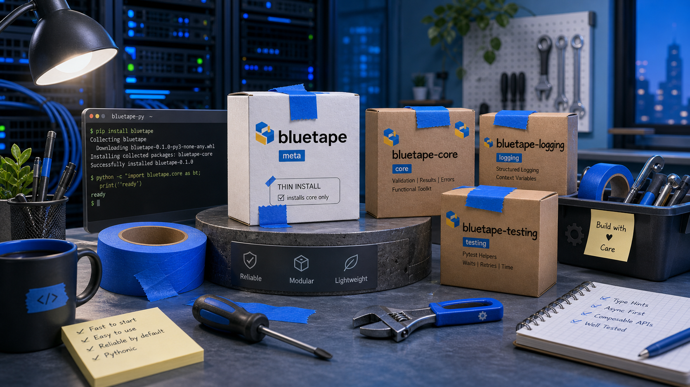
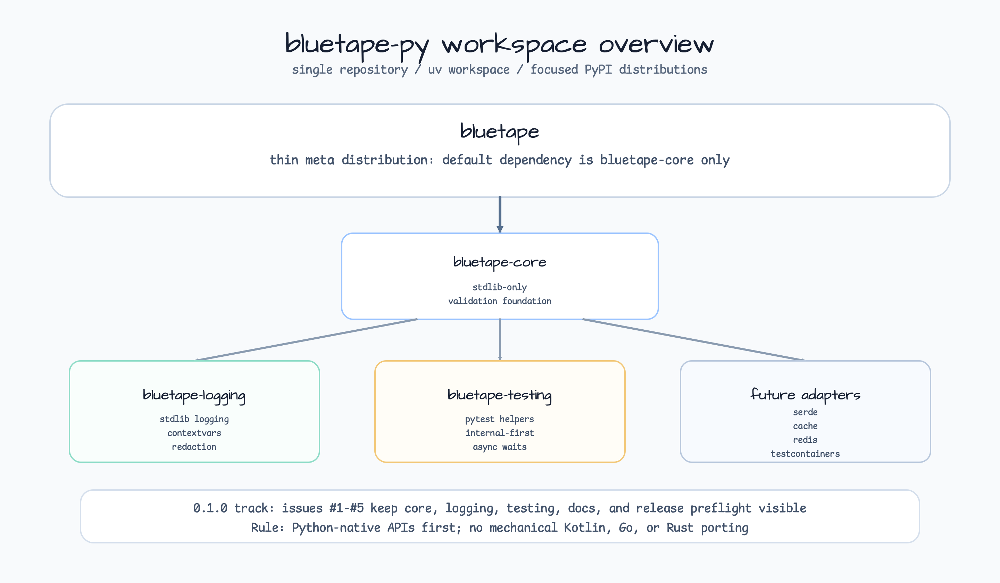

# bluetape-py

[English](README.md) | [한국어](README.ko.md)



백엔드 서비스, 테스트, 로깅, 운영 보조 기능을 위한 Python-native bluetape
라이브러리입니다.

`bluetape-py`는 `bluetape4k`, `bluetape-go`, `bluetape-rs`와 같은 생태계
운영 원칙을 따르지만, 다른 언어 구현을 기계적으로 옮기지 않습니다. Python
3.13+를 기준으로 시작하고, 기본 설치는 얇게 유지하며, 무거운 기능은 명시적인
PyPI 배포 패키지와 extras로 분리합니다.

## 현재 상태

`v0.1.0`은 첫 Python-native foundation 릴리스로 공개되었습니다:
[`v0.1.0`](https://github.com/bluetape4k/bluetape-py/releases/tag/v0.1.0).
PyPI 배포는 package ownership과 trusted publishing이 확인될 때까지 보류합니다.
새 collections 패키지는 source workspace에서 사용할 수 있으며, registry 설치
명령은 PyPI 배포가 활성화된 뒤의 목표 형태를 설명합니다.

현재 계획 트랙은
[`0.2.0`](https://github.com/bluetape4k/bluetape-py/milestone/2) milestone입니다.
#7-#34 이슈로 ecosystem backlog를 확장합니다. 자세한 계획은
[`WIP.md`](WIP.md)에 두고, 완료된 사용자-facing 변경은
[`CHANGELOG.md`](CHANGELOG.md)에 기록합니다.

| 트랙 | 범위 |
|---|---|
| `v0.1.0` | 릴리스 완료: workspace, core, logging, testing, docs, release preflight. |
| `0.2.0` | 진행 중인 ecosystem planning과 첫 확장 이슈 #7-#34. |
| PyPI publish | project ownership과 trusted publishing 확인 전까지 보류. |

## 워크스페이스 구조



저장소는 하나의 `uv` 워크스페이스이며, 여러 개의 목적별 배포 패키지를 가집니다.
메타 패키지는 의도적으로 작게 유지합니다. `pip install bluetape`는 기본적으로
`bluetape-core`만 설치합니다.

| 배포 패키지 | Import 경로 | 기본 설치 | 상태 | 목적 |
|---|---|---:|---|---|
| `bluetape` | 없음 | yes | active | `bluetape-core`에만 의존하는 얇은 메타 배포 패키지. |
| `bluetape-core` | `bluetape.core` | yes | active | 표준 라이브러리만 사용하는 검증 및 기반 헬퍼. |
| `bluetape-async` | `bluetape.asyncio` | no | active, source workspace | 표준 라이브러리만 사용하는 bounded structured-concurrency 헬퍼. |
| `bluetape-collections` | `bluetape.collections` | no | active, source workspace | 표준 라이브러리만 사용하는 eager iterable/list/dict 헬퍼. |
| `bluetape-logging` | `bluetape.logging` | no | active | 표준 `logging`, `contextvars`, redaction 헬퍼. |
| `bluetape-testing` | `bluetape.testing` | no | active, internal-first | 이 워크스페이스 내부 테스트를 우선 지원하는 pytest 헬퍼와 작은 공개 안정 API. |
| `bluetape-serde` | `bluetape.serde` | no | planned | core API가 안정화된 뒤 다룰 serialization 경계 헬퍼. |
| `bluetape-cache` | `bluetape.cache` | no | planned | 캐시 추상화와 인메모리 헬퍼. |
| `bluetape-redis` | `bluetape.redis` | no | planned | cache 계약을 검증한 뒤 추가할 Redis 어댑터. |
| `bluetape-testcontainers` | `bluetape.testcontainers` | no | planned | 통합 테스트가 많은 패키지를 위한 Testcontainers fixture. |
| `bluetape-fastapi` | `bluetape.fastapi` | no | planned | core/logging/testing 계층이 안정화된 뒤 추가할 FastAPI 연동 헬퍼. |

## 설계 방향

- Python-native API를 먼저 설계합니다. Kotlin, Go, Rust 구현은 참고 대상이지
  복사 원본이 아닙니다.
- `bluetape-core`는 표준 라이브러리만 사용합니다.
- `bluetape-logging`은 `logging`과 `contextvars` 기반의 stdlib-first 모듈로
  유지합니다.
- `bluetape-testing`은 `pytest`에 의존할 수 있지만, 넓은 공개 API를 약속하기
  전에 내부 지원 모듈로 먼저 성장시킵니다.
- 루트 `bluetape` 배포 패키지는 extras를 제공하지만, 루트
  `bluetape/__init__.py` import surface는 만들지 않습니다.

## 설치

PyPI 배포는 아직 보류 중입니다. 배포가 활성화되기 전에는 registry 설치 명령 대신
아래의 로컬 workspace 명령을 사용합니다.

첫 PyPI 릴리스 이후의 공개 설치 형태는 다음과 같습니다.

```bash
pip install bluetape
pip install "bluetape[asyncio]"
pip install "bluetape[collections]"
pip install "bluetape[logging]"
pip install "bluetape[testing]"
pip install "bluetape[dev]"
pip install "bluetape[all]"
```

목적별 배포 패키지를 직접 설치할 수도 있습니다.

```bash
pip install bluetape-core
pip install bluetape-async
pip install bluetape-collections
pip install bluetape-logging
pip install bluetape-testing
```

저장소에서 로컬 개발 환경을 만들 때는 다음 명령을 사용합니다.

```bash
uv sync --all-packages
```

## 사용 예

### Core validation

```python
from bluetape.core import require_not_blank

service_name = require_not_blank("orders", "service_name")
```

### Logging context

```python
import logging

from bluetape.logging import ContextLogFilter, log_context

logger = logging.getLogger("orders")
logger.addFilter(ContextLogFilter())

with log_context(trace_id="trace-123", tenant="blue"):
    logger.info("order accepted")
```

### Testing waits

```python
from bluetape.testing import eventually

eventually(lambda: cache.get("ready"), timeout=2.0)
```

### Collections

```python
from bluetape.collections import chunked, group_by

chunks = chunked(range(5), 2)
by_initial = group_by(["ant", "ape", "bee"], lambda value: value[0])
```

### Bounded asyncio 작업

```python
import asyncio

from bluetape.asyncio import map_bounded


async def fetch_order(order_id: int) -> str:
    await asyncio.sleep(0.01)
    return f"order-{order_id}"


async def main() -> None:
    print(await map_bounded([1, 2, 3], fetch_order, limit=2, timeout=1.0))


asyncio.run(main())
```

## 패키지 문서

| 패키지 | 문서 |
|---|---|
| `bluetape` | [packages/bluetape/README.md](packages/bluetape/README.md) |
| `bluetape-async` | [packages/bluetape-async/README.md](packages/bluetape-async/README.md) |
| `bluetape-collections` | [packages/bluetape-collections/README.md](packages/bluetape-collections/README.md) |
| `bluetape-core` | [packages/bluetape-core/README.md](packages/bluetape-core/README.md) |
| `bluetape-logging` | [packages/bluetape-logging/README.md](packages/bluetape-logging/README.md) |
| `bluetape-testing` | [packages/bluetape-testing/README.md](packages/bluetape-testing/README.md) |

## 로드맵

| 트랙 | 계획 |
|---|---|
| `v0.1.0` | 초기 core, logging, testing, 문서, release preflight foundation을 릴리스했습니다. |
| `0.2.0` | #7-#34로 ecosystem package planning을 추적하고, broad adapter는 research gate를 먼저 둡니다. |
| 이후 | 기본 패키지가 안정화된 뒤 FastAPI 헬퍼와 workshop 예제를 추가합니다. |

프로젝트 관리와 릴리스 정책은 다음 문서에서 관리합니다.

- [WIP.md](WIP.md)
- [CHANGELOG.md](CHANGELOG.md)
- [Package layout policy](docs/package-layout.md)
- [Release guide](docs/release.md)
- [Research index](docs/research/README.ko.md)

## 생태계 백로그

`0.2.0` milestone은 bluetape-go와 bluetape4k 생태계에서 이미 검증된 기능을
Python-native 패키지로 옮기기 위한 다음 범위를 추적합니다. Python 패키지 경계나
의존성 선택이 분명하지 않은 항목은 구현 전에 research issue로 먼저 다룹니다.
이슈별 task queue는 [`WIP.md`](WIP.md), research gate는
[`docs/research/README.ko.md`](docs/research/README.ko.md)를 봅니다.

## 개발

```bash
uv sync --all-packages
uv build --all-packages
uv run pytest
uv run ruff check .
uv run ruff format --check .
```
