# Issue #46 Apache Fory TDD 및 성능 근거

날짜: 2026-07-11
환경: macOS arm64, CPython 3.13.14, pyfory 1.3.0

## 명령

```bash
uv run --package bluetape-serde --extra fory --python 3.13.14 \
  pytest packages/bluetape-serde/tests/test_fory_performance.py -q -s
```

결과: `5 passed in 0.19s`.

## 측정

다음은 smoke observation이며 absolute performance gate가 아니다.

| 사례 | Encoded bytes | Serialize 1000 | Deserialize 1000 | tracemalloc peak |
|---|---:|---:|---:|---:|
| Small | 39 | 0.001181 s | 0.001523 s | 905 B |
| Large, 4096 scores | 8167 | 0.009620 s | 0.025476 s | 156427 B |

```mermaid
xychart-beta
    title "Encoded size and traced peak allocation"
    x-axis [Small, Large]
    y-axis "Bytes" 0 --> 160000
    bar [39, 8167]
    bar [905, 156427]
```



| Isolated native RSS scenario | Encoded bytes | RSS high-water bytes |
|---|---:|---:|
| Small | 33 | 29458432 |
| Large | 8161 | 29884416 |
| Post-contention | 8161 | 30212096 |

## 분석

- 하나의 adapter가 `max_concurrency=4`에서 32개의 concurrent serialization과
  이후 decode/encode reuse를 견뎠다.
- Large input은 예상대로 encoded size, elapsed time, traced allocation을 늘렸다.
  Absolute latency나 memory threshold는 주장하지 않는다.
- 각 RSS scenario를 별도의 bounded subprocess에서 실행했으므로 high-water
  value는 누적된 process history가 아니라 서로 비교 가능한 observation이다.
- Adapter byte 및 concurrency limit는 acceptance bound이며 hard CPU 또는 RSS
  ceiling이 아니다.
