# Issue #46 Apache Fory TDD and Performance Evidence

Date: 2026-07-11
Environment: macOS arm64, CPython 3.13.14, pyfory 1.3.0

## Command

```bash
uv run --package bluetape-serde --extra fory --python 3.13.14 \
  pytest packages/bluetape-serde/tests/test_fory_performance.py -q -s
```

Result: `5 passed in 0.19s`.

## Measurements

These are smoke observations, not absolute performance gates.

| Case | Encoded bytes | Serialize 1000 | Deserialize 1000 | tracemalloc peak |
|---|---:|---:|---:|---:|
| Small | 39 | 0.001181 s | 0.001523 s | 905 B |
| Large, 4096 scores | 8167 | 0.009620 s | 0.025476 s | 156427 B |

```mermaid
xychart-beta
    title "Encoded size and traced peak allocation"
    x-axis [Small, Large]
    y-axis "Bytes" 0 --> 160000
    bar [39, 8167]
    bar [905, 156427]
```



| Isolated native RSS scenario | Encoded bytes | RSS high-water bytes |
|---|---:|---:|
| Small | 33 | 29458432 |
| Large | 8161 | 29884416 |
| Post-contention | 8161 | 30212096 |

## Analysis

- One adapter survived 32 concurrent serializations and subsequent decode/encode reuse
  with `max_concurrency=4`.
- Large input increased encoded size, elapsed time, and traced allocation as expected;
  no absolute latency or memory threshold is asserted.
- Each RSS scenario ran in a separate bounded subprocess, so the high-water values are
  comparable observations rather than cumulative process history.
- Adapter byte and concurrency limits are acceptance bounds, not hard CPU or RSS ceilings.
