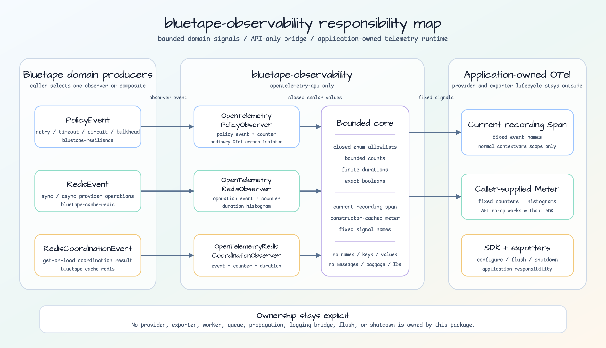

# bluetape-observability

[English](README.md) | 한국어

Bluetape resilience와 Redis observer event를 OpenTelemetry API에 연결하는 opt-in 패키지입니다.

## 책임 경계

Bridge의 제한된 signal 기록과 application-owned OpenTelemetry runtime 및 exporter lifecycle의
책임을 분리합니다.



[편집 가능한 SVG 열기](../../docs/images/readme-diagrams/bluetape-observability-architecture.svg)

## 설치와 선행 패키지

```bash
pip install bluetape-observability
```

root extra는 제공하지 않습니다. bridge와 application이 실제로 쓰는 domain 패키지만 직접
설치합니다.

| 사용 범위 | 직접 설치할 배포 패키지 |
|---|---|
| Policy event | `bluetape-observability + bluetape-resilience` |
| Redis provider와 coordination event | `bluetape-observability + bluetape-cache-redis` |
| 두 domain 모두 | `bluetape-observability + bluetape-resilience + bluetape-cache-redis` |

Domain 패키지는 이 bridge의 test-only dependency입니다. Application이 필요한 domain 패키지를
직접 소유하고 설치합니다.

## 공개 adapter와 고정 signal

- `OpenTelemetryPolicyObserver`는 `bluetape.resilience.policy.events`를 기록합니다.
- `OpenTelemetryRedisObserver`는 `bluetape.redis.operations`와 duration을 기록합니다.
- `OpenTelemetryRedisCoordinationObserver`는
  `bluetape.redis.coordination.operations`와 duration을 기록합니다.

고정된 low-cardinality enum, 범위가 제한된 count, boolean, duration만 읽습니다. Policy 이름,
Redis key/value/namespace, exception message, 임의 attribute, log context, baggage, trace ID 값은
자동으로 올리지 않습니다.

## API 전용 예제

SDK를 설정하지 않아도 OpenTelemetry API의 no-op 경로로 안전하게 호출할 수 있습니다.

<!-- api-only-example:start -->
```python
from bluetape.cache.redis import (
    RedisCoordinationEvent,
    RedisCoordinationOperation,
    RedisCoordinationOutcome,
    RedisEvent,
    RedisMode,
    RedisOperation,
    RedisOutcome,
)
from bluetape.observability.redis import (
    OpenTelemetryRedisCoordinationObserver,
    OpenTelemetryRedisObserver,
)
from bluetape.observability.resilience import OpenTelemetryPolicyObserver
from bluetape.resilience import (
    EventKind,
    FailureCategory,
    PolicyEvent,
    PolicyOutcome,
    PolicyType,
)

OpenTelemetryPolicyObserver()(
    PolicyEvent(
        policy_name="orders",
        policy_type=PolicyType.RETRY,
        kind=EventKind.SUCCEEDED,
        outcome=PolicyOutcome.SUCCESS,
        failure_category=FailureCategory.NONE,
        attempt=1,
        delay=None,
        timeout=None,
        state=None,
        previous_state=None,
        in_flight=None,
        waiters=None,
    )
)
OpenTelemetryRedisObserver().on_event(
    RedisEvent(
        mode=RedisMode.SYNC,
        operation=RedisOperation.GET,
        outcome=RedisOutcome.SUCCESS,
        error_code=None,
        elapsed_ns=1,
    )
)
OpenTelemetryRedisCoordinationObserver().on_event(
    RedisCoordinationEvent(
        mode=RedisMode.ASYNC,
        operation=RedisCoordinationOperation.GET_OR_LOAD,
        outcome=RedisCoordinationOutcome.LOADED,
        error_code=None,
        attempts=1,
        polls=0,
        cleanup_failed=False,
        elapsed_ns=1,
    )
)
```
<!-- api-only-example:end -->

## Application-owned SDK 예제

운영 exporter 선택, provider 설정, flush, shutdown은 application-owned 책임입니다.

<!-- sdk-example:start -->
```python
from opentelemetry.sdk.metrics import MeterProvider
from opentelemetry.sdk.metrics.export import InMemoryMetricReader
from opentelemetry.sdk.trace import TracerProvider
from opentelemetry.sdk.trace.export import SimpleSpanProcessor
from opentelemetry.sdk.trace.export.in_memory_span_exporter import InMemorySpanExporter

from bluetape.cache.redis import RedisEvent, RedisMode, RedisOperation, RedisOutcome
from bluetape.observability.redis import OpenTelemetryRedisObserver

reader = InMemoryMetricReader()
meter_provider = MeterProvider(metric_readers=[reader], shutdown_on_exit=False)
exporter = InMemorySpanExporter()
tracer_provider = TracerProvider(shutdown_on_exit=False)
tracer_provider.add_span_processor(SimpleSpanProcessor(exporter))
observer = OpenTelemetryRedisObserver(meter=meter_provider.get_meter("orders"))
tracer = tracer_provider.get_tracer("orders")
shutdown_order = []
try:
    with tracer.start_as_current_span("redis-get"):
        observer.on_event(
            RedisEvent(
                mode=RedisMode.SYNC,
                operation=RedisOperation.GET,
                outcome=RedisOutcome.SUCCESS,
                error_code=None,
                elapsed_ns=1,
            )
        )
finally:
    tracer_provider.shutdown()
    shutdown_order.append("tracer")
    meter_provider.shutdown()
    shutdown_order.append("meter")
```
<!-- sdk-example:end -->

## Caller-owned 조합

각 producer는 observer 하나를 받습니다. OTel adapter만 지정하면 기존 observer를 대체합니다
(`replaces the previous observer`). 순서와 실패 정책은 caller-owned composite에서 명시합니다.

Resilience 예제는 `fail-stop`입니다. 앞 callback이 실패하면 뒤 callback을 호출하지 않습니다.

<!-- resilience-composition:start -->
```python
calls = []

def audit(event):
    calls.append("audit")

def otel(event):
    calls.append("otel")

def compose(*observers):
    def observe(event):
        for observer in observers:
            observer(event)
    return observe

compose(audit, otel)(object())
```
<!-- resilience-composition:end -->

Redis 예제는 `fail-continue`입니다. 뒤 callback을 계속 호출하고 진단은 application에 남깁니다.

<!-- redis-composition:start -->
```python
calls = []

class Composite:
    def __init__(self, *observers):
        self.observers = observers

    def on_event(self, event):
        for observer in self.observers:
            try:
                observer.on_event(event)
            except Exception:
                continue

class Recorder:
    def __init__(self, name):
        self.name = name

    def on_event(self, event):
        calls.append(self.name)

Composite(Recorder("audit"), Recorder("otel")).on_event(object())
```
<!-- redis-composition:end -->

다른 순서와 실패 처리는 caller가 정합니다.

## 실패, context, 진단

생성은 fail-fast입니다. Meter 조회나 instrument 생성 실패는 application wiring 실패입니다. Event별
일반 OpenTelemetry 오류는 독립적으로 격리해 domain 결과를 보존하고, process-control
`BaseException`은 전파합니다. 변경 가능한 health 상태(`no mutable health`)와 diagnostic callback은
제공하지 않습니다.
SDK/exporter 전송 상태는 application-owned OpenTelemetry 설정으로 진단합니다.

현재 span은 일반 sync와 coroutine `contextvars` 범위에서만 찾습니다. raw threads,
`run_in_executor`, detached/background task, process, remote transport, context 종료 뒤 callback에는
암묵적 전파 보장이 없습니다. Log context나 baggage를 telemetry로 올리지 않으며, log에 trace ID나
span ID를 자동으로 추가하지 않습니다.

## 롤백 (rollback)

Rollback은 producer에서 adapter를 제거하고 기존 observer를 복원하거나
(`restores the prior observer`) caller-owned composite를 복원하는 작업입니다. Data/schema
migration은 필요하지 않습니다.
